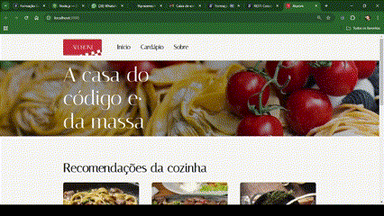

## Welcome again to another TypeScript project! 👋

# Aluroni Restaurant Page!

## Test the project yourself: [Teste the project here!!!](https://react-router-dom-studies.vercel.app/)

### Home Page



### Routes between pages 


### Dish filter by type


### 404 Page


## Some code that I'm proud of
```js
export default function AppRouter() {
  return (
    <main className='container'>
      <Router>
        <Menu />
        <Routes>
          <Route path='/' element={<PaginaPadrao />}>
            <Route index element={<Inicio />} />
            <Route path='cardapio' element={<Cardapio />} />
            <Route path='/sobre' element={<Sobre />} />
          </Route>
          <Route path='prato/:id' element={<Prato />} />
          <Route path='*' element={<NotFound />} />
        </Routes>
      </Router>
      <Footer />
    </main>
  );
}
```

## Built with

- TypeScript;
- Scss;
- React Router Dom.

## Author

- Website - [My GitHub](https://github.com/lucasbailo)
- Frontend Mentor - [@lucasbailo](https://www.frontendmentor.io/profile/lucasbailo)
- Instagram - [@lucassbailo](https://www.instagram.com/lucassbailo/)
- LinkedIn - [Lucas Bailo](https://www.linkedin.com/in/lcsbailo)